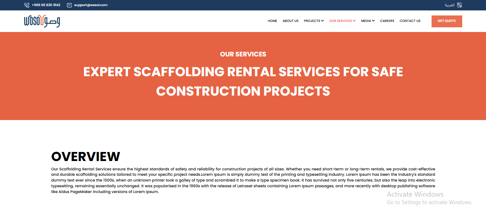
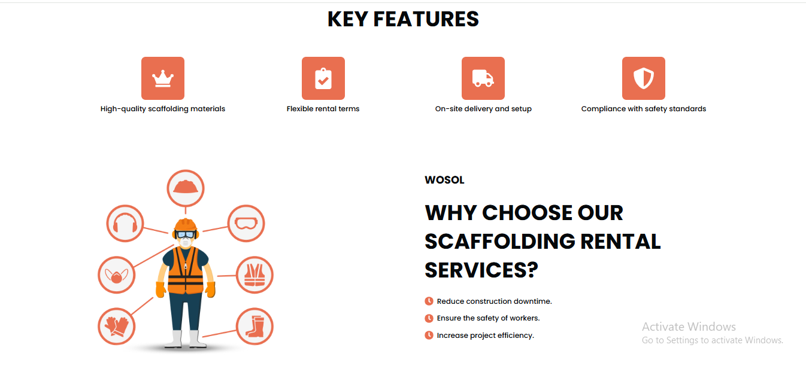

# Dezen Technology

## Introduction
This Website is a **static clone** of a Figma design, developed using **React, Tailwind CSS, React CSS, and Vite**. The project focuses on creating a **modern UI** with a well-structured component-based architecture.

## Technology Stack
- **React** - JavaScript library for building UI components.
- **Tailwind CSS** - Utility-first CSS framework for styling.
- **React CSS** - Component-level styling.
- **Vite** - Modern frontend build tool for fast performance.
- **Vercel** - Deployment of React Website static clone.

## Project Type-
Frontend (Static)


##  Deployment
🔗 **Live Site**: [Click Here](https://dezen-dechnology.vercel.app/)


## **Directory Structure**
```
frontend/
├─ node_modules/
├─ public/
├─ src/
│  ├─ assets/
│  │  ├─ images/
│  ├─ components/
│  │  ├─ overview/
│  │  │  ├─ Faq.jsx
│  │  │  ├─ Keyfeatures.jsx
│  │  │  ├─ Overview.jsx
│  │  │  ├─ StepsSection.jsx
│  │  │  ├─ TestimonialSection.jsx
│  │  │  ├─ Whytochoose.jsx
│  │  ├─ Content.jsx
│  │  ├─ DetailForm.jsx
│  │  ├─ Footer.jsx
│  │  ├─ Navbar.jsx
│  │  ├─ Services.jsx
│  ├─ App.css
│  ├─ App.jsx
│  ├─ index.css
│  ├─ main.jsx
```

---

## **Sample Images of the Project**
- First

- Second


For more Visit the live link => https://dezen-dechnology.vercel.app/

## **Features**
✔️Adaptable to screeen size 1920px and below 1280px automatically  
✔️ Component-based architecture  
✔️ Clean and well-structured code  
✔️ Styled using Tailwind CSS  
✔️ Optimized for performance using Vite  


## **Installation & Getting Started**
To **run the project locally**, follow these steps:

### **1️⃣ Clone the Repository**
```bash
git clone https://github.com/MayankBelwal05/Dezen-Tech.git
cd frontend
npm install
npm run dev

🚀 Now, open your browser and go to http://localhost:5173/
```
## Usage-
- The Navbar includes UI links and a button aligned to the right.

- The project follows a Figma-based design for visual consistency.
- Component structure ensures reusability and maintainability.

## **🙏Thank You for Visting**